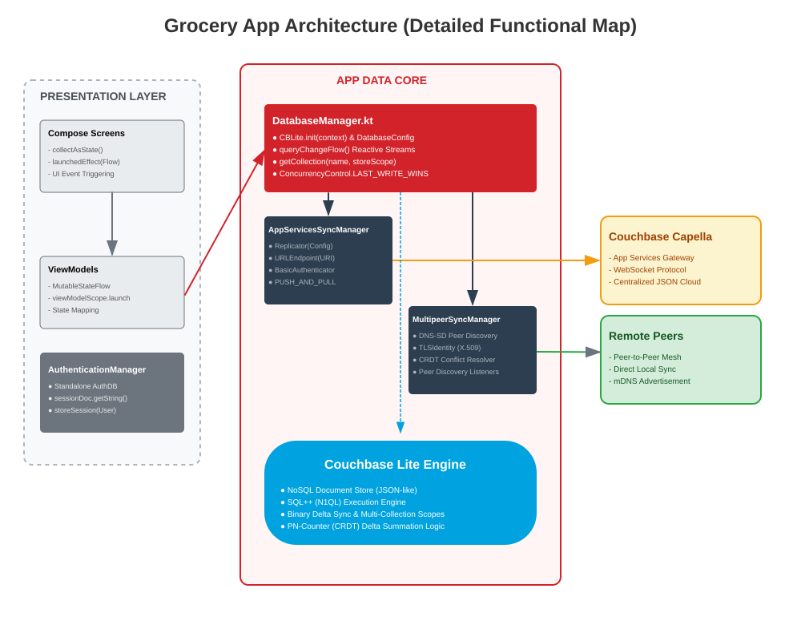
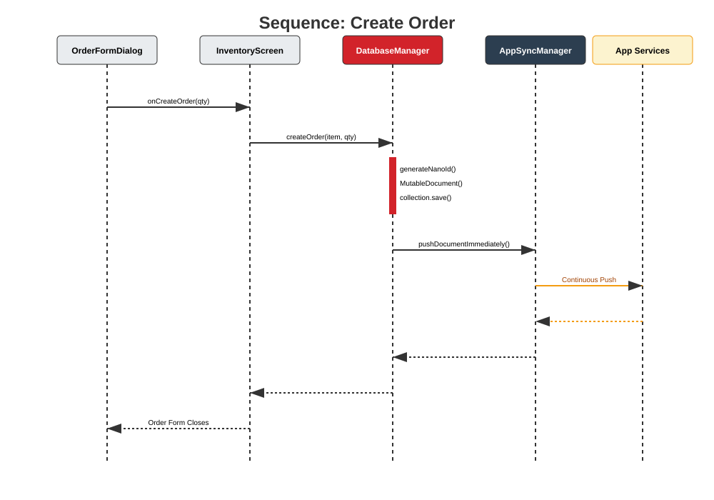

# Couchbase Lite Retail Demo - Android

A retail inventory management app for Android demonstrating Couchbase Lite's offline-first capabilities, real-time sync with Capella App Services, and peer-to-peer sync between devices.

## Prerequisites

> [!IMPORTANT]
> Before proceeding with the Android setup, you **must** complete the Capella backend configuration described in the [root README](../README.md). This includes creating a Capella cluster, deploying an App Service, setting up the bucket/scopes/collections, importing the sample dataset, creating App Endpoints and App Users, and recording the public connection URL. If you skip these steps, the app will fail to authenticate and sync.

## Quick Start (For Already Configured Systems)

If you've already completed the initial setup and have Java 17 + Couchbase Lite EE installed:

```bash
# Open the project in Android Studio
open -a "Android Studio" /path/to/Android

# Or build from command line
cd /path/to/Android
./gradlew assembleDebug

# Install on device
./gradlew installDebug
```

**First time setup?** Continue reading below for complete installation instructions.

## Requirements

- **Android Studio**: Ladybug (2024.2.1) or later
- **Android SDK**:
  - Minimum SDK: 24 (Android 7.0 Nougat)
  - Target SDK: 35 (Android 15)
  - Compile SDK: 35
- **JDK**: 17 or later
- **Kotlin**: 2.0.21
- **Homebrew**: For installing Java on macOS (optional but recommended)

## Dependencies

The project uses Gradle with Kotlin DSL for dependency management. Key dependencies:

- **Couchbase Lite Android**: 3.3.0 (Enterprise Edition with KTX extensions)
- **Jetpack Compose**: Material 3 UI components
- **Kotlin Coroutines**: For asynchronous operations
- **Lifecycle Components**: ViewModel and LiveData

All dependencies are declared in `gradle/libs.versions.toml` and automatically resolved by Gradle.

## Initial Setup (macOS)

### Step 1: Install Java 17

If you don't have Java 17 installed, install it using Homebrew:

```bash
# Install OpenJDK 17
brew install openjdk@17

# Configure environment variables in ~/.zshrc
echo 'export PATH="/opt/homebrew/opt/openjdk@17/bin:$PATH"' >> ~/.zshrc
echo 'export JAVA_HOME="/opt/homebrew/opt/openjdk@17"' >> ~/.zshrc

# Apply changes
source ~/.zshrc

# Verify installation
java -version
```

You should see: `openjdk version "17.0.x"`

### Step 2: Configure Gradle for SSL

Create global Gradle configuration to handle SSL certificates:

```bash
# Create global gradle.properties
cat > ~/.gradle/gradle.properties << 'EOF'
# Global Gradle properties
org.gradle.jvmargs=-Xmx2048m -Dfile.encoding=UTF-8 -Djavax.net.ssl.trustStoreType=KeychainStore
org.gradle.daemon=true
org.gradle.parallel=true
org.gradle.caching=true
EOF
```

### Step 3: Install Couchbase Lite Enterprise Edition (Local Repository)

Due to SSL certificate issues with the Couchbase Maven repository, we need to manually download the Enterprise Edition libraries:

```bash
# Create local Maven repository directories
mkdir -p ~/.m2/repository/com/couchbase/lite/couchbase-lite-android-ee-ktx/3.3.0
mkdir -p ~/.m2/repository/com/couchbase/lite/couchbase-lite-android-ee/3.3.0

# Download EE KTX (72KB)
cd ~/.m2/repository/com/couchbase/lite/couchbase-lite-android-ee-ktx/3.3.0
curl -L -k "https://mobile.maven.couchbase.com/maven2/dev/com/couchbase/lite/couchbase-lite-android-ee-ktx/3.3.0/couchbase-lite-android-ee-ktx-3.3.0.aar" -o couchbase-lite-android-ee-ktx-3.3.0.aar
curl -L -k "https://mobile.maven.couchbase.com/maven2/dev/com/couchbase/lite/couchbase-lite-android-ee-ktx/3.3.0/couchbase-lite-android-ee-ktx-3.3.0.pom" -o couchbase-lite-android-ee-ktx-3.3.0.pom

# Download EE Core (9.4MB)
cd ~/.m2/repository/com/couchbase/lite/couchbase-lite-android-ee/3.3.0
curl -L -k "https://mobile.maven.couchbase.com/maven2/dev/com/couchbase/lite/couchbase-lite-android-ee/3.3.0/couchbase-lite-android-ee-3.3.0.aar" -o couchbase-lite-android-ee-3.3.0.aar
curl -L -k "https://mobile.maven.couchbase.com/maven2/dev/com/couchbase/lite/couchbase-lite-android-ee/3.3.0/couchbase-lite-android-ee-3.3.0.pom" -o couchbase-lite-android-ee-3.3.0.pom

# Verify files were downloaded
ls -lh ~/.m2/repository/com/couchbase/lite/couchbase-lite-android-ee-ktx/3.3.0/
ls -lh ~/.m2/repository/com/couchbase/lite/couchbase-lite-android-ee/3.3.0/
```

**Note**: The `-k` flag bypasses SSL certificate verification. This is only needed for the initial download. Once files are in your local Maven repository (`~/.m2/`), Gradle will use them directly.

## Getting Started

### 1. Verify Prerequisites

Before opening the project, ensure:

```bash
# Check Java version
java -version  # Should show 17.0.x

# Check Gradle wrapper exists
cd /path/to/Android
ls -la gradlew  # Should exist and be executable

# Verify Couchbase EE is installed locally
ls -la ~/.m2/repository/com/couchbase/lite/couchbase-lite-android-ee/3.3.0/*.aar
```

### 2. Open the Project

Open Android Studio and select **File** > **Open**, then navigate to the `Android` directory and open it.

Android Studio will automatically sync Gradle and resolve dependencies from:
1. Local Maven repository (`~/.m2/repository/`) for Couchbase Lite EE
2. Google Maven for Android libraries  
3. Maven Central for other dependencies

This may take a few minutes on first open.

### 3. Configure Capella App Services

Before running the app, configure your Capella App Services connection using environment variables or Gradle properties.

**Where to find `CBL_BASE_URL`**: In your Capella dashboard, go to **App Services** > select your App Endpoint (e.g. `supermarket-nyc`) > **Connect** tab. Copy the **Public Connection URL**, it will look like `wss://<id>.apps.cloud.couchbase.com`. Use only the base URL; do **not** append the database name (that is handled separately by `CBL_AA_DB` / `CBL_NYC_DB`).

#### Option A: Environment Variables (Recommended)

Set these environment variables before running Android Studio:

```bash
export CBL_BASE_URL="wss://your-endpoint.apps.cloud.couchbase.com:4984"
export CBL_AA_DB="supermarket-aa"
export CBL_NYC_DB="supermarket-nyc"
export CBL_AA_USER="aa-store-01@supermarket.com"
export CBL_NYC_USER="nyc-store-01@supermarket.com"
export CBL_PASSWORD="P@ssword1"
```

Then launch Android Studio from the same terminal:

```bash
studio.sh  # or open -a "Android Studio" on macOS
```

#### Option B: Gradle Properties

Add these properties to your local `gradle.properties` file (create it in the `Android` directory if it doesn't exist):

```properties
CBL_BASE_URL=wss://your-endpoint.apps.cloud.couchbase.com:4984
CBL_AA_DB=supermarket-aa
CBL_NYC_DB=supermarket-nyc
CBL_AA_USER=aa-store-01@supermarket.com
CBL_NYC_USER=nyc-store-01@supermarket.com
CBL_PASSWORD=P@ssword1
```

**Note**: Do not commit `gradle.properties` with sensitive credentials to version control.

### 4. Build and Run

Select an emulator or connected device from the device dropdown and click **Run** (▶).

## Project Structure

```
Android/
├── app/
│   ├── src/main/
│   │   ├── java/com/example/groceryapplication/
│   │   │   ├── GroceryApplication.kt          # Application class
│   │   │   ├── MainActivity.kt                # Main activity with Compose setup
│   │   │   ├── AppConfig.kt                   # Configuration (database, sync, stores)
│   │   │   ├── DatabaseManager.kt             # Couchbase Lite database operations
│   │   │   ├── AppServicesSyncManager.kt      # Sync with Capella App Services
│   │   │   ├── MultipeerSyncManager.kt        # Peer-to-peer sync
│   │   │   ├── AuthenticationManager.kt       # User authentication
│   │   │   ├── Screens/
│   │   │   │   ├── LoginScreen.kt
│   │   │   │   ├── InventoryScreen.kt
│   │   │   │   ├── OrdersScreen.kt
│   │   │   │   └── ProfileScreen.kt
│   │   │   └── Models/
│   │   │       ├── GroceryItem.kt
│   │   │       ├── Order.kt
│   │   │       └── StoreProfile.kt
│   │   ├── res/                               # Resources (layouts, drawables, etc.)
│   │   └── AndroidManifest.xml
│   ├── build.gradle.kts                       # App-level Gradle build file
│   └── proguard-rules.pro
├── gradle/
│   ├── libs.versions.toml                     # Centralized dependency versions
│   └── wrapper/                               # Gradle wrapper files
├── build.gradle.kts                           # Project-level Gradle build file
└── gradle.properties                          # Gradle configuration
```

## Configuration Details

### Database Settings

- **Database Name**: `GroceryInventoryDB`
- **Scopes**: `AA-Store`, `NYC-Store` (based on selected store)
- **Collections**:
  - `inventory` - Product inventory items
  - `orders` - Customer orders
  - `profile` - Store profile information

### Sync Configuration

The app uses continuous replication, which is event-driven (not polling). Changes are pushed and pulled immediately over a persistent WebSocket connection to Capella App Services.

Key settings in `AppConfig.kt`:
- `SYNC_CONTINUOUS`: Enables real-time bidirectional sync
- `ENABLE_APP_SERVICES_SYNC`: Toggle cloud sync on/off
- `ENABLE_P2P_SYNC`: Toggle peer-to-peer sync on/off

## Features

### Real-Time Sync with Capella

The app syncs inventory, orders, and store profile data with your Capella cluster through App Services. Changes made in the app are immediately synced to the cloud and to other connected devices.

### Peer-to-Peer Sync

Devices on the same local network can sync directly with each other without going through the cloud. This is useful for:
- Demo scenarios with multiple devices
- Offline collaboration between nearby devices
- Reducing cloud bandwidth usage

P2P sync uses the same peer group ID as the iOS app, enabling cross-platform local sync between Android and iOS devices.

### Offline-First Architecture

The app works fully offline using Couchbase Lite as the local database. All operations (create, read, update, delete) work without network connectivity. When connectivity is restored, changes automatically sync to the cloud.

### Jetpack Compose UI

The app is built entirely with Jetpack Compose, Google's modern declarative UI toolkit for Android. This provides a responsive and intuitive user experience.

## Building the App

### Debug Build

```bash
./gradlew assembleDebug
```

Output: `app/build/outputs/apk/debug/app-debug.apk`

### Release Build

```bash
./gradlew assembleRelease
```

For production releases, configure signing in `app/build.gradle.kts`.

### Install on Device

```bash
./gradlew installDebug
```

## Troubleshooting

### Build Errors

**"Could not install Gradle distribution" or SSL/Certificate errors**

If you see errors related to Gradle distribution or SSL certificates:

```bash
# Stop all Gradle daemons
cd /path/to/Android
./gradlew --stop

# Clean caches
rm -rf .gradle/
rm -rf ~/.gradle/daemon/

# Verify global gradle.properties exists with SSL config
cat ~/.gradle/gradle.properties
# Should contain: -Djavax.net.ssl.trustStoreType=KeychainStore

# Restart Android Studio and sync again
```

**"Could not resolve com.couchbase.lite:couchbase-lite-android-ee-ktx"**

This usually means the Couchbase Lite EE libraries aren't in your local Maven repository:

```bash
# Verify the files exist
ls -la ~/.m2/repository/com/couchbase/lite/couchbase-lite-android-ee/3.3.0/*.aar
ls -la ~/.m2/repository/com/couchbase/lite/couchbase-lite-android-ee-ktx/3.3.0/*.aar

# If missing, re-run Step 3 from Initial Setup
```

Also verify that `settings.gradle.kts` includes `mavenLocal()`:

```kotlin
dependencyResolutionManagement {
    repositoriesMode.set(RepositoriesMode.PREFER_SETTINGS)
    repositories {
        mavenLocal()  // Must be first!
        google()
        mavenCentral()
    }
}
```

**"BuildConfig cannot be resolved"**
- Make sure `buildFeatures { buildConfig = true }` is set in `app/build.gradle.kts`
- Sync project with Gradle files (**File** > **Sync Project with Gradle Files**)
- Verify all required environment variables or Gradle properties are set

**Gradle sync failures**
- Verify Java 17 is installed: `java -version`
- Check `JAVA_HOME` is set: `echo $JAVA_HOME`
- Update Android Gradle Plugin: **Tools** > **SDK Manager** > **SDK Tools**
- Clean and rebuild: **Build** > **Clean Project**, then **Build** > **Rebuild Project**
- Try invalidating caches: **File** > **Invalidate Caches** > **Invalidate and Restart**

### Sync Issues

**Sync not working**
- Verify your `CBL_BASE_URL` is correct and includes `wss://` protocol
- Check that configuration variables are properly set (check Logcat for printed config)
- Verify your App Services endpoint is running in Capella
- Check Logcat for sync-related error messages (filter by "AppServicesSyncManager")

**Authentication failures**
- Ensure the user credentials match those configured in Capella App Services
- Verify the database name (`CBL_AA_DB` or `CBL_NYC_DB`) matches your App Endpoint
- Check that the username format matches the expected pattern

### Runtime Issues

**App crashes on launch**
- Check Logcat for stack traces
- Verify all required configuration values are set (not empty strings)
- Ensure the device/emulator meets minimum API level 24

**Data not appearing**
- Confirm your Capella cluster has data imported into the correct scope/collection
- Check that scope and collection names in `AppConfig.kt` match your Capella setup
- Look for database errors in Logcat (filter by "DatabaseManager")

**P2P sync not discovering devices**
- Ensure devices are on the same Wi-Fi network
- Check that local network permissions are granted
- Verify the `P2P_PEER_GROUP_ID` is the same across all devices
- Look for P2P-related logs in Logcat (filter by "MultipeerSyncManager")

## Debugging

### Enable Verbose Logging

Couchbase Lite logging can be configured in `DatabaseManager.kt` to help debug sync and database issues:

```kotlin
Database.log.console.level = LogLevel.VERBOSE
```

### Inspect Database

You can use the Couchbase Lite command-line tool to inspect the database file:
1. Pull the database from device: `adb pull /data/data/com.example.groceryapplication/files/GroceryInventoryDB.cblite2`
2. Use `cblite` tool to query the database

## Additional Notes

### Configuration Files Created During Setup

The following files were created or configured during the initial setup process:

#### Global Configuration (`~/.gradle/gradle.properties`)

Contains JVM arguments and Gradle settings, including SSL certificate handling:

```properties
org.gradle.jvmargs=-Xmx2048m -Dfile.encoding=UTF-8 -Djavax.net.ssl.trustStoreType=KeychainStore
org.gradle.daemon=true
org.gradle.parallel=true
org.gradle.caching=true
```

#### Project Configuration (`settings.gradle.kts`)

Configured with `mavenLocal()` repository to use locally downloaded Couchbase Lite EE:

```kotlin
dependencyResolutionManagement {
    repositoriesMode.set(RepositoriesMode.PREFER_SETTINGS)
    repositories {
        mavenLocal()  // Check local Maven repository first
        google()
        mavenCentral()
        maven {
            url = uri("https://mobile.maven.couchbase.com/maven2/dev/")
            isAllowInsecureProtocol = false
        }
    }
}
```

#### Environment Variables (`~/.zshrc`)

Java configuration added to your shell profile:

```bash
export PATH="/opt/homebrew/opt/openjdk@17/bin:$PATH"
export JAVA_HOME="/opt/homebrew/opt/openjdk@17"
```

### Enterprise vs Community Edition

This project uses Couchbase Lite Enterprise Edition, which includes features like:
- **Peer-to-peer sync** (MultipeerReplicator) - Required for this demo
- **Encrypted sync** - Additional security layer
- **Delta sync** - More efficient synchronization

The Community Edition does **not** include peer-to-peer sync, so the MultipeerSyncManager features won't work if you switch to CE.

To use the Community Edition (if you don't need P2P sync), change the dependency in `app/build.gradle.kts`:

```kotlin
// Replace enterprise edition
implementation("com.couchbase.lite:couchbase-lite-android-ee-ktx:3.3.0")

// With community edition (available on Maven Central)
implementation("com.couchbase.lite:couchbase-lite-android-ktx:3.3.0")
```

You would also need to comment out or remove the P2P sync functionality in:
- `MultipeerSyncManager.kt`
- `MultipeerSyncComponents.kt`
- References to MultipeerSyncManager in other screens

### Verification Commands

To verify your setup:

```bash
# Check Java
java -version  # Should show: openjdk version "17.0.x"

# Check Gradle
./gradlew --version  # Should show: Gradle 8.11.1

# Check Couchbase EE locally installed
ls -la ~/.m2/repository/com/couchbase/lite/couchbase-lite-android-ee/3.3.0/*.aar

# Test build
./gradlew assembleDebug  # Should complete successfully
```

## Related Documentation

- [Main Project README](../README.md) - Complete setup including Capella cluster configuration
- [iOS App README](../iOS/README.md) - iOS version of this app
- [Web App README](../web/README.md) - Web version of this app
- [Couchbase Lite Android Documentation](https://docs.couchbase.com/couchbase-lite/current/android/quickstart.html)


## Navigating the Codebase 

The repository contains significant amounts of code across various layers. For a developer specifically interested in Couchbase Lite, approximately **80% of the codebase consists of Android framework "noise"** (UI, navigation, and theme boilerplate).

We provide guidance as to which parts of the code are of particular relevance.

### The framework "Noise" (Safe to ignore)

These components manage the presentation and Android environment but contain no database logic:

- **`ui/theme/*` & `MainActivity.kt`**: Application styling and standard Android permission handling
- **`LandingScreen.kt` & Navigation**: Jetpack Compose routing between different app screens
- **`InventoryScreen.kt`, `GroceryItemCard.kt`, & `LoginScreen.kt`**: UI layouts and Compose states for displaying and interacting with data

### The Couchbase "Heart" (Focus here)

The core database implementation is concentrated in these key files:

- **`DatabaseManager.kt`**: The central orchestrator for the database lifecycle and reactive queries
- **`AppServicesSyncManager.kt`**: Manages cloud synchronization with Couchbase Capella App Services
- **`MultipeerSyncManager.kt`**: Implements serverless P2P synchronization
- **`AuthenticationManager.kt`**: Handles user sessions using a dedicated local database
- **`CRDTCounter.kt`**: Provides conflict-free quantity management for distributed inventory

## System Architecture

The application uses a reactive pattern where data flows from the Couchbase Lite engine directly into the UI layers via Kotlin StateFlows.



### Component Roles

- **`DatabaseManager`**: Initializes Couchbase Lite and opens the `GroceryInventoryDB`. It manages dynamic data partitioning by opening collections (`inventory`, `orders`, `profile`) within store-specific scopes like `AA-Store` or `NYC-Store` based on the user's login.
- **`AppServicesSyncManager`**: Configures and manages a continuous, bidirectional `Replicator` to sync local collections with a remote WebSocket endpoint in Couchbase Capella
- **`MultipeerSyncManager`**: Uses the `MultipeerReplicator` API to discover nearby devices via DNS-SD and sync data over a secure, TLS-encrypted mesh network
- **`AuthenticationManager`**: Operates a standalone `AuthDB` to persist `user_session` documents. This allows user login states to persist across app restarts independently of the main inventory database 

## Recommended Learning Path

For developers new to this project, explore the source code in the following order to understand the data flow:

1. **Initialize**: `DatabaseManager.kt`. Learn how the engine and collections are opened
2. **Authenticate**: `AuthenticationManager.kt`. See how simple local persistence works
3. **Sync Cloud**: `AppServicesSyncManager.kt`. Review the `Replicator` configuration
4. **Sync P2P**: `MultipeerSyncManager.kt`. Understand serverless discovery and TLS security
5. **Handle Conflicts**: `CRDTCounter.kt`. Examine the implementation of conflict-free counters

## Primary Workflow: "Create Order"

This workflow demonstrates how a user action bridges the UI, the local database, and cloud synchronization.



### Execution Steps

1. **UI Submission**: A user enters a quantity in the `OrderFormDialog` and clicks "Create Order"
2. **Manager Call**: The UI triggers `databaseManager.createOrder(item, quantity)`.
3. **Local Persistence**

    - The `DatabaseManager` accesses the `orders` collection for the active store scope
    - It generates a unique document ID using a NanoID-style algorithm
    - A `MutableDocument` is created, populated with the order details, and saved locally via `collection.save()`

4. **Sync Trigger**: If cloud sync is enabled, the manager calls `pushDocumentImmediately(documentId)`
5. **Transmission**: The `AppServicesSyncManager` ensures the continuous replicator detects the new local document and transmits it immediately to Capella

## Key Implementation Patterns

### Synchronization with App Services

The application implements a centralized cloud synchronization pattern through the `AppServicesSyncManager`, which orchestrates a `Replicator` to bridge local collections with Couchbase Capella. This implementation utilizes a `ReplicatorConfiguration` that targets a specific `URLEndpoint` and employs a `BasicAuthenticator` for secure communication.

The synchronization is configured as a `PUSH_AND_PULL` type and operates in a continuous, event-driven mode rather than relying on polling. This ensures that changes in the `inventory`, `profile`, and `orders` collections are synchronized in real-time. To maintain high responsiveness for critical actions, the `DatabaseManager` can trigger an explicit `pushDocumentImmediately` call, forcing the replicator to pick up local changes (such as a newly created replenishment order) and transmit them to App Services without delay.

### Scopes and Collections (CBL 3.0+ Architecture)

The app utilizes the latest Couchbase Lite organizational structure to partition data dynamically.

- **Logical Partitioning**: Instead of just using the default database, the app organizes data into a specific `scopeName` (e.g., `AA-Store` or `NYC-Store`)
- **Categorization**: Within those scopes, it separates data into three distinct collections: `inventory`, `orders`, and `profile`. This reflects a production-ready multi-tenant or multi-location strategy

### Reactive API via Kotlin Extensions (KTX)

The codebase demonstrates how to use official Couchbase Lite KTX extensions to integrate with modern Android reactive patterns.

- **`queryChangeFlow()`**: In `DatabaseManager.getOrdersFlow()`, the app uses this built-in extension to convert a Query into a Cold Flow.
- **Automatic Updates**: This allows the UI to stay in sync with the database without manual polling or observer management

### Custom Conflict Resolution

While many apps rely on "Last Write Wins," this project implements sophisticated custom resolution logic for distributed environments.

- **`GroceryCRDTResolver`**: The app defines a custom `ConflictResolver` for the `MultipeerReplicator`
- **Convergent Merging**: This resolver specifically understands the PN-Counter structure, manually merging the "p" (positive) and "n" (negative) dictionaries from local and remote documents to ensure no inventory updates are lost during a sync conflict

### Security: TLS Identities for P2P

For the serverless P2P mesh network, security is handled natively within the Couchbase SDK.

- **`TLSIdentity`**: The `MultipeerSyncManager` creates or retrieves a self-signed TLS identity for the device.
- **Authenticated Discovery**: It uses a `MultipeerCertificateAuthenticator` to validate peers before allowing them to join the mesh network

### Performance Optimization: Value Indexing

To ensure searches remain fast as the database grows (the app handles over 3,000 items), it utilizes native indexing.

- **`IndexBuilder`**: The `DatabaseManager` programmatically creates value indexes for the `name` and `category` properties within the inventory collection
- **Search Performance**: These indexes are essential for the case-insensitive searches performed in `searchGrocery()`

