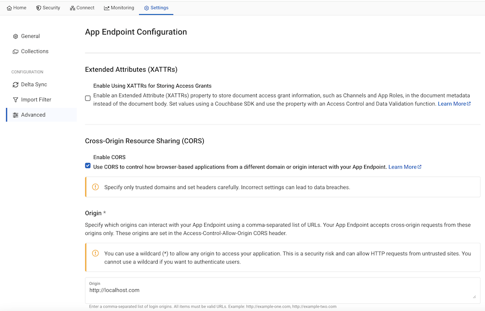
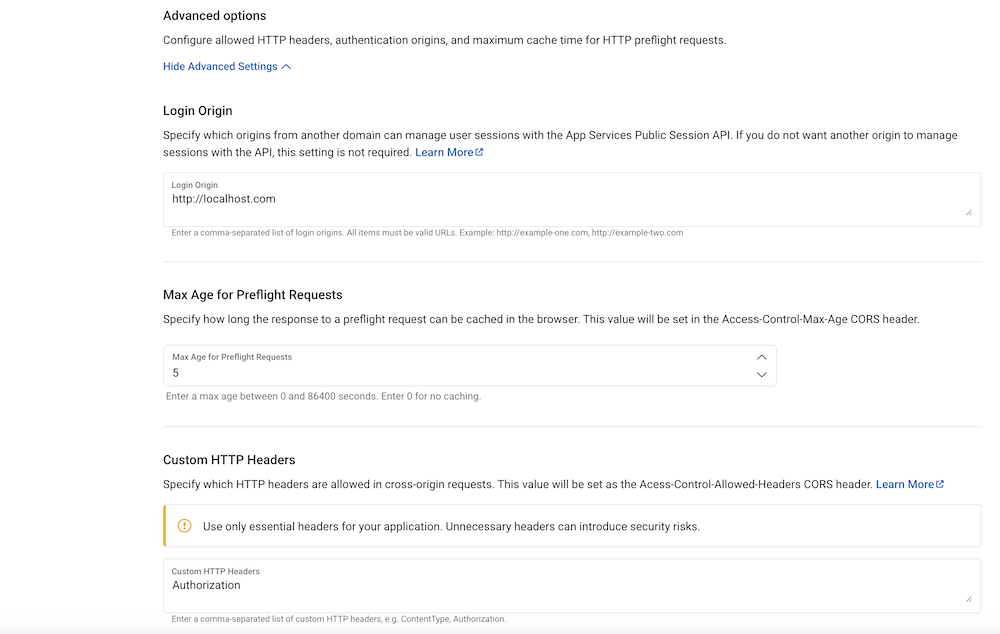

# Couchbase Mobile & DocumentVault Demo Application

This repository contains a multi-platform application built with [Couchbase Lite](https://docs.couchbase.com/couchbase-lite/current/index.html) for web and mobile (iOS and Android). It features **DocumentVault (FileVault)**, a secure, offline-first document management system showcasing Couchbase Lite's vector search, hybrid search, dynamic seeding, and compliance capabilities.

---

## 📂 DocumentVault (FileVault) iOS App Overview

The iOS application has been migrated to **DocumentVault**, showcasing offline-first document discovery, semantic indexing, and local data governance.

### 🧠 Semantic & Hybrid Search Engines
* **Vector Configuration**: The database vector index `vector_idx` has been optimized to use the `.cosine` (Cosine similarity) metric to align similarity search with the unit L2-normalized query and document vectors.
* **Scanned Image Vectorization**: Removed image constraints from the embedding service to generate semantic text-based embeddings for image/camera documents based on their name, visual classification tags, and summary descriptors.
* **Hybrid Search Integration**: Merges Full-Text Search (FTS) and vector retrieval using Reciprocal Rank Fusion (RRF) and leverages session-level Rocchio relevance feedback to dynamically adjust user query vectors.

### 🌱 Seed Sample Dataset
* Includes a precompiled corporate legal dataset ([document_vault_sample_dataset.json](./datasets/document_vault_sample_dataset.json)) featuring folders and metadata-rich records (NDAs, CEO tax filings, Deloitte audits, HR handbooks, DB specs).
* Accessible from the **Developer Tools** section in [ProfileView.swift](./iOS/DocumentVault/ProfileView.swift), developers can trigger **"Seed Sample Corporate Data"** to automatically insert documents and folders and generate vector embeddings on-device on-the-fly.

---

## 🗺️ DocumentVault Development Roadmap

### Phase 1: Foundation (Completed)
* Local SQLite/Couchbase Lite schema for document metadata, folders, and custody events.
* Local processing pipeline supporting PDF/TXT OCR, Vision categorization, and summaries.
* Hybrid search with Rocchio query refinement and domain-based tenant scopes.

### Phase 2: Enhanced Profiling (Immediate Next Steps)
* Add custom NetDocuments-style profile metadata: `Client`, `Matter`, `Author`, and `Document Type`.
* Implement parent-child validation rules (e.g., matching matter codes to specific client identifiers).

### Phase 3: Sync & Peer-to-Peer Collaboration (Mid-Term)
* Dynamic tenant-scoped sync configuration to Couchbase Capella cluster endpoints.
* Peer-to-peer data replication over local networks using MultipeerConnectivity on iOS, with custom conflict resolution rules.

### Phase 4: Compliance & Advanced Intelligence (Long-Term)
* Cryptographically sign and hash document custody chain logs (uploads, reviews, downloads, edits).
* Expose visual history timeline graphs for documents.
* Implement a CoreML-based local transformer (e.g., legal-BERT) for highly specialized domain embeddings offline.

---

## 🏗️ System & Data Architecture

### 1. Couchbase Server / Capella Database Topology
The cloud backend stores data inside a single bucket mapped to dynamic corporate scopes representing tenants:
```
📦 DocumentVault (Bucket)
├── 📁 acme-corp (Scope / Tenant ID)
│   ├── 📚 documents (Collection: metadata, embeddings, FTS texts)
│   ├── 📚 folders (Collection: folder configurations)
│   ├── 📚 annotations (Collection: highlights and reviews)
│   ├── 📚 profile (Collection: user/tenant settings)
│   ├── 📚 senders (Collection: email/ingest identities)
│   └── 📚 threads (Collection: conversation threads)
```

### 2. In-App Couchbase Lite Data Structure
Couchbase Lite mirrors the Capella structure locally inside `DocumentVaultDB.cblite2` with optimized indexing for quick offline retrieval:
* **Collections**:
  * `documents`: Main model (`VaultDocument`) storing the document hash, text extraction `textContent`, LLM `summary`, 512-dimension vector `embedding`, and full append-only `custodyChain`.
  * `folders`: Workspace hierarchies (`Folder`).
  * `annotations`: User highlights/reviews (`Annotation`).
* **Indexes**:
  * `vector_idx`: Vector search index configured on the `embedding` property utilizing **Cosine similarity** (512 dimensions, centroids = 1). Vector embeddings are generated on-device from a combined target of the cleaned filename and the AI summary (or tag surrogate fallback for images), enabling highly precise semantic search targets.
  * `fts_idx`: Full-Text Search index tracking `name`, `textContent`, `summary`, and `tags` to power keyword queries.
  * `folder_idx`, `updated_idx`, `owner_idx`: Value indexes for fast folder hierarchy navigation.

### 3. iOS Application Folder Structure
```
iOS/
├── DocumentVault/
│   ├── DocumentVaultApp.swift           # Application entry point (@main)
│   ├── AppConfig.swift                 # Configuration & tenant resolver
│   ├── DatabaseManager.swift           # Database lifecycle, indexes, and queries
│   ├── SampleSeeder.swift              # Local corporate sample data seeder
│   ├── DocumentProcessingPipeline.swift # Ingestion pipeline
│   ├── EmbeddingManager.swift          # CoreML-based word/sentence vector extractor
│   ├── EmbeddingService.swift          # Embedding routing interface
│   ├── Views/
│   │   ├── SearchView.swift            # Keyword & hybrid RRF search
│   │   ├── FolderBrowserView.swift     # Hierarchy explorer
│   │   └── ProfileView.swift           # User settings and developer tools
│   └── Models/
│       ├── VaultDocument.swift         # Metadata, custody chains, and status
│       └── StoreProfile.swift          # Folders, annotations, and profiles
```

---

## Demo App Features

- 📱 **Offline-First**: Ability to operate in disconnected mode without an Internet connection with Couchbase Lite as a local database.
- 🔄 **Real-Time Sync**: Opportunistically sync data, in uni-directional or bi-directional mode with backend Couchbase Capella clusters via Capella App Services. Data is synced across iOS, Android and JS app via App Services.
- 🔄 **Peer-to-Peer Sync**: Sync data directly between iOS and Android apps over a local network
- 🏪 **Multi-Platform Support**: Support for **[iOS](https://docs.couchbase.com/couchbase-lite/current/swift/quickstart.html)**, **[Android](https://docs.couchbase.com/couchbase-lite/current/android/quickstart.html)** and **[web](https://docs.couchbase.com/couchbase-lite-javascript/current/index.html)**. Note that Couchbase Lite supports a broader range of platforms including C, Java, .NET, React Native, Ionic, Flutter etc.

## Demo Video

### Peer-to-Peer Sync across iOS and Android

A demo video where we are able to sync data between two android devices and an iPhone with CouchbaseLite's P2P.

https://github.com/user-attachments/assets/eec4bbed-5fa3-4b55-8b07-f4df01574c33

### Real time Data Sync via Capella App Services

https://github.com/user-attachments/assets/781028cf-6f67-4ad9-abd5-a52daf4c83d6

https://github.com/user-attachments/assets/72f61f2b-118f-4bc6-8f43-30dfac6e8f5e

## Demo Setup

The complete setup of the demo would look like this:


> [!NOTE]
> You are not required to go through the entire setup. Depending on the app and functionality of interest, you can proceed with just the setup required for just that app and functionality.

## Setting up Capella Cluster

These are common set of instructions that you must follow to setup the cloud backend regardless of whether you are running iOS, Android and web versions of the app.

Although instructions are specified for Capella App Services, equivalent instructions apply to self-managed Sync Gateway as well.

- Create a couchbase cluster on Capella by following these [instructions](https://docs.couchbase.com/cloud/get-started/create-account.html).

### Deploy App Service (do this early — it takes 5–25 minutes)

> [!TIP]
> App Service deployments can take between 5 and 25 minutes. Start the deployment now so it can provision in the background while you set up the bucket, scopes, collections, and sample data in the steps that follow.

- Create an App Service named **"supermarket-appservice"** (you can name it anything) that is linked to the cluster you just created by following these [instructions](https://docs.couchbase.com/cloud/get-started/create-account.html#app-services)

### Create Bucket, Scopes and Collections

> [!NOTE]
> The Capella UI only lets you create **one** scope and **one** collection at the time of bucket creation. The remaining scope and collections must be added afterwards. The steps below reflect that flow.

1. **Create the bucket with its first scope and collection.** Follow these [instructions](https://docs.couchbase.com/cloud/clusters/data-service/about-buckets-scopes-collections.html#buckets) and, on the bucket-creation screen, fill in:
   - **Bucket name**: `supermarket`
   - **Scope name**: `NYC-Store`
   - **Collection name**: `inventory`

2. **Add the second scope.** In the `supermarket` bucket, add a new scope named `AA-Store` by following these [instructions](https://docs.couchbase.com/cloud/clusters/data-service/about-buckets-scopes-collections.html#scopes).

3. **Add the remaining collections.** Using these [instructions](https://docs.couchbase.com/cloud/clusters/data-service/scopes-collections.html#create-collection), add collections so each scope ends up with **`inventory`**, **`profile`**, and **`orders`**:
   - In **`NYC-Store`**: add `profile` and `orders` (the `inventory` collection already exists from step 1).
   - In **`AA-Store`**: add `inventory`, `profile`, and `orders`.

At the end of these steps, your cluster configuration should look something like . You have probably not yet imported any data, so your collections will show no documents.

## Importing Sample Data Set

- Download and unzip sample dataset from [demo-dataset.zip](https://cbm-retaildemo-dataset.s3.us-west-1.amazonaws.com/demo-dataset.zip)

- Follow [instructions](https://docs.couchbase.com/cloud/clusters/data-service/import-data-documents.html#how-to-import-data) to import the data set into corresponding scope/collection via inline mode.

> [!NOTE]
>  When importing data, Select the Field option to map doc Id.


## Configuring Capella App Services

By now your App Service deployment (started earlier) should be ready or close to ready.

- Create two App Endpoints corresponding to the two scopes. This is an example for AA store. Name App Endpoints as **"supermarket-aa"** and **"supermarket-nyc"** by following these [instructions](https://docs.couchbase.com/cloud/get-started/configuring-app-services.html#create-app-endpoint).

The configuration of App Endpoint should look like this:


- Configure two App Users corresponding to the two stores (one in each App Endpoint) by following these [instructions](https://docs.couchbase.com/cloud/app-services/user-management/create-user.html).You can choose any password. If you would like to run the app with prefilled demo credentials, you must use the password mentioned below. This will make more sense when you setup the individual apps later.
   - **user**=nyc-store-01@supermarket.com / **password**=P@ssword1 (this is created in App Endpoint supermarket-nyc)
   - **user**=aa-store-01@supermarket.com / **password**=P@ssword1 (this is created App Endpoint supermarket-aa)

The configuration of App User should look something like this:


- Go to the "connect" tab and record the public URL endpoint. You will need it when you setup your apps later


### CORS Setup for Web Applications

If you are trying out the web application, you will need to configure App Endpoints to enable CORS. Skip this section if you are only testing mobile apps.
Repeat these steps for each of the App Endpoints

- Enable CORS on your App Endpoint from the Settings Page by following these [instructions](https://docs.couchbase.com/cloud/app-services/deployment/cors-configuration-for-app-services.html#about-cors-configuration)
  
- Set **Origin** as "http://localhost:8080". This corresponds to the URL that is running the web app. Make sure the ports match as well
  

- Set **Login Origin** as "http://localhost:8080". This corresponds to the URL that is running the web app. Make sure the ports match as well

- Set **Allowed Headers** as "Authorization". This corresponds to the URL that is running the web app. Make sure the ports match as well
  

## Repo Structure

The repo is organized as follows

- **iOS**: This folder includes source code corresponding to the iOS version of the retail application. Follow the instructions in the [README.md](./iOS/README.md) file in the folder to build and run the iOS app. That folder also includes instructions to run the app in peer-to-peer mode.

- **Android**: This folder includes source code corresponding to the Android version of the retail application. Follow the instructions in the [README.md](./Android/README.md) file in that folder to build and run the Android app. That folder also includes instructions to run the app in peer-to-peer mode.

- **web**: This folder includes source code corresponding to the web version of the retail application. Follow the instructions in the [README.md](./web/README.md) file in that folder to build and run the web app.
