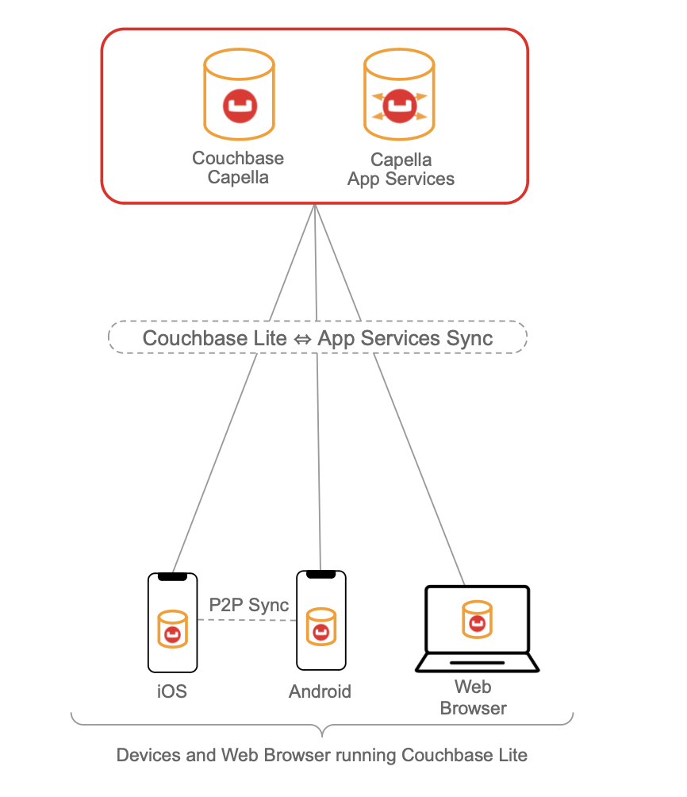
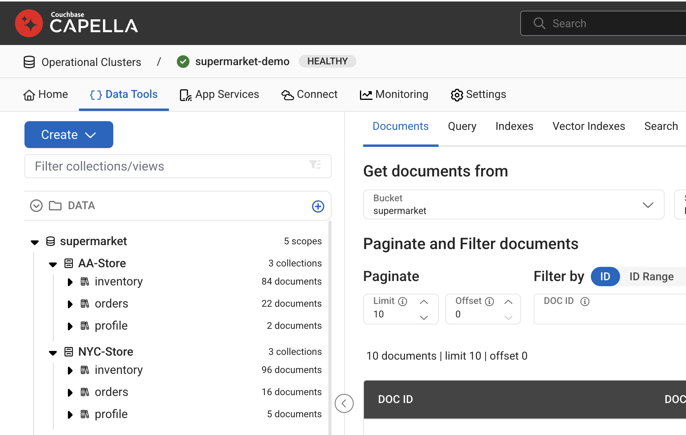
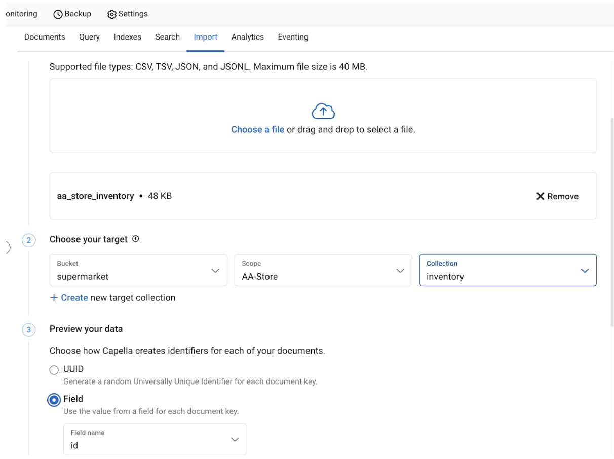
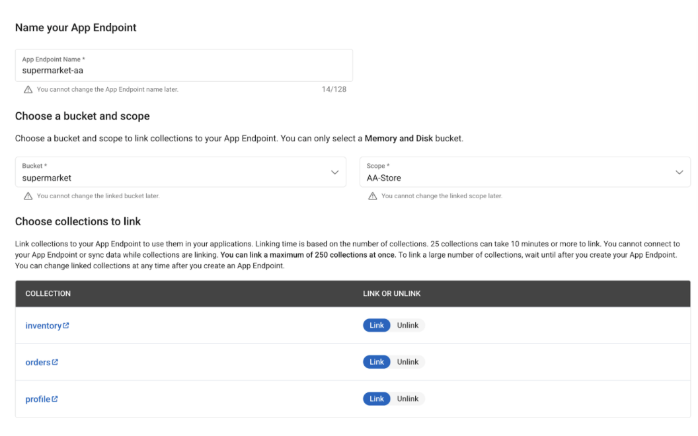
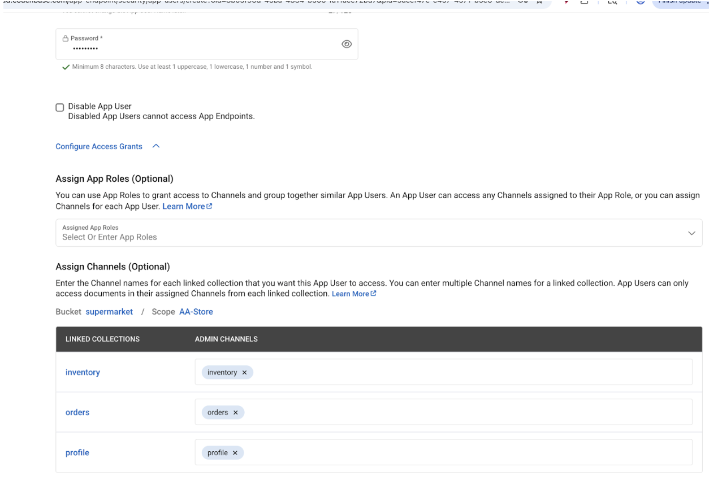
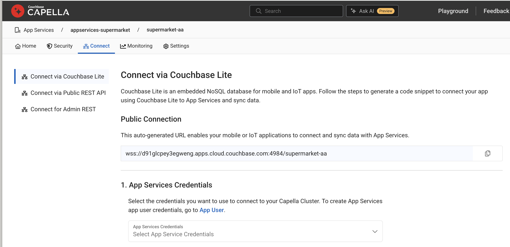

# Couchbase Mobile Retail Demo Application

A simple retail inventory management application built with [Couchbase Lite](https://docs.couchbase.com/couchbase-lite/current/index.html) for web and mobile (iOS and Android) featuring real-time sync capabilities with [Couchbase Capella App Services](https://docs.couchbase.com/cloud/app-services/deployment/creating-an-app-service.html).

## Demo App Features

- 📱 **Offline-First**: Ability to operate in disconnected mode without an Internet connection with Couchbase Lite as a local database. 
- 🔄 **Real-Time Sync**: Opportunistically sync data, in uni-directional or bi-directional mode with backend Couchbase Capella clusters via Capella App Services. Data is synced across iOS, Android and JS app via App Services.
- 🔄 **Peer-to-Peer Sync**: Sync data directly between iOS and Android apps over a local network
- 🏪 **Multi-Platform Support**: Support for [iOS](https://docs.couchbase.com/couchbase-lite/current/swift/quickstart.html), [Android](https://docs.couchbase.com/couchbase-lite/current/android/quickstart.html) and [web](TODO). Note that Couchbase Lite supports a broader range of platforms including C, Java, .NET, React Native, Ionic, Flutter etc.

## Demo Video
### Peer-to-Peer Sync across iOS and Android
A demo video where we are able to sync data between two android devices and an iPhone with CouchbaseLite's P2P.

<video src="https://github.com/couchbase-examples/couchbase-lite-retail-demo/blob/main/common/assets/P2P_demo_android-android-ios.mp4" controls width="700">
  Your browser does not support the video tag.
</video>

> **Note**: If the video doesn't load, you can view it directly [here](./common/assets/P2P_demo_android-android-ios.mp4).

## Setup
The complete setup of the demo would look like this:

> [!NOTE]
> You are not required to go through the entire setup. Depending on the app and functionality of interest, you can proceed with just the setup required for just that app and functionality.

## Setting up Capella Cluster
These are common set of instructions that you must follow to setup the cloud backend regardless of whether you are running iOS, Android and web versions of the app.

Although instructions are specified for Capella App Services, equivalent instructions apply to self-managed Sync Gateway as well. 

- Create a couchbase cluster on Capella by following these [instructions](https://docs.couchbase.com/cloud/get-started/create-account.html).
  
- Create a bucket named **"supermarket"** cluster on Capella by following these [instructions](https://docs.couchbase.com/cloud/clusters/data-service/about-buckets-scopes-collections.html#buckets). 

- Create two scopes named **"NYC-Store"** and **"AA-Store"** in the bucket by following these [instructions](https://docs.couchbase.com/cloud/clusters/data-service/about-buckets-scopes-collections.html#scopes). 

- In each scope, create three collections named **"inventory"**, **"profile"** and **"orders"** respectively by following these [instructions](https://docs.couchbase.com/cloud/clusters/data-service/scopes-collections.html#create-collection). 

- At end of the steps, your cluster configuration should look something like . You have probably not yet imported any data, so your collections will show no documents.

## Importing Sample Data Set

- Download and unzip sample dataset from [demo-dataset.zip](https://cbda-pulkit-bucket.s3.us-west-1.amazonaws.com/All-Jsons/demo-dataset.zip)

- Follow [instructions](https://docs.couchbase.com/cloud/clusters/data-service/import-data-documents.html#how-to-import-data) to import the data set into corresponding scope/collection via inline mode. 
> [!NOTE]
>  When importing data, Select the Field option to map doc Id. 

## Setting up Capella App Services

- Create App Services named **"supermarket-appservice"** (you can name it anything) that is linked to supermarket cluster by following these [instructions](https://docs.couchbase.com/cloud/get-started/create-account.html#app-services) 

- Create two App Endpoints corresponding to the two scopes. This is an example for AA store. Name App Endpoints as **"supermarket-aa"** and **"supermarket-nyc"** by following these [instructions](https://docs.couchbase.com/cloud/get-started/configuring-app-services.html#create-app-endpoint).

The configuration of App Endpoint should look like this: 

- Configure two App Users corresponding to the two stores (one in each App Endpoint) by following these [instructions](https://docs.couchbase.com/cloud/app-services/user-management/create-user.html).You can choose any password. If you would like to run the app with prefilled demo credentials, you must use the password mentioned below. This will make more sense when you setup the individual apps later.
   - **user**=nyc-store-01@supermarket.com / **password**=P@ssword1 (this is created in App Endpoint supermarket-aa)
   - **user**=aa-store-01@supermarket.com / **password**=P@ssword1 (this is created App Endpoint supermarket-nyc) 

The configuration of App User should look something like this:

- Go to the "connect" tab and record the public URL endpoint. You will need it when you setup your apps later

## Repo Structure

The repo is organized as follows

- **iOS**: This folder includes source code corresponding to the iOS version of the retail application. Follow the instructions in the [README.md](./iOS/README.md) file in the folder to build and run the iOS app. That folder also includes instructions to run the app in peer-to-peer mode.

- **Android**: This folder includes source code corresponding to the Android version of the retail application. Follow the instructions in the [README.md](./Android/README.md) file in that folder to build and run the Android app. That folder also includes instructions to run the app in peer-to-peer mode.

- **web**: This folder includes source code corresponding to the web version of the retail application. Follow the instructions in the [README.md](./web/README.md) file in that folder to build and run the web app.

### Real time Data Sync via Capella App Services

